# Overflow

**Real-time binary options / price prediction dApp on Sui**

**Powered by** Sui Move + Object-centric model + Pyth Hermes price attestations + Off-chain state (Supabase) + x402-style payments  

**Simply means:** *Trade binary options with oracle-bound resolution and on-chain custody.*

| Link | URL |
|------|-----|
| **Live app** | [overflow-sui.vercel.app](https://overflow-sui.vercel.app/) |
| **Pitch deck** | [Google Slides](https://docs.google.com/presentation/d/1CsGdNswj-Cxm7cYSEf6w-IBL-vDho05Xo9qyUOzcjyE/edit?usp=sharing) |
| **GitHub** | [OverFlow](https://github.com/AmaanSayyad/OverFlow) |

---

## Problem

Real-time prediction and binary options in Web3 need **strong security** (deposits/withdrawals) and **low latency** (rounds, UX). Many chains struggle with both. Users want instant bets without signing every trade; they also want funds secured on-chain.

## Solution — Overflow

- **Native USDC on Sui** — Deposit once to house balance; place many bets without per-bet gas or wallet prompts.
- **Trade at 5s, 15s, 30s, 1m, 3m, 5m** — Multiple timeframes; grid cells with multipliers; win when the price line crosses your cell.
- **Pyth Hermes** — Real-time BTC/SUI/SOL prices for fair, instant resolution.
- **On-chain treasury (Move)** — Deposits and withdrawals secured by a shared treasury contract; events drive off-chain balance sync.
- **Blitz rounds** — Time-limited 2× multiplier rounds (optional x402 entry).
- **AI insights** — Optional paid predictions via x402 micropayment flow.
- **Settlement** — Off-chain state (Supabase) for speed; on-chain custody for security.

## How it works (5 steps)

1. **User lands** → Connects Sui wallet and deposits **USDC** to the treasury (house balance).
2. **Clicks Bet** → Selects amount, timeframe, and taps **cells** (multipliers) on the chart.
3. **Win condition** → If the **price line crosses the cell** of the chosen multiplier during the round, it is a **win**.
4. **Balance update** → Wins and losses update the user's house balance (off-chain).
5. **Withdrawal** → User withdraws USDC from the treasury back to their wallet (on-chain).

---

## Built on Sui

- **Native USDC** for deposits, bets, and withdrawals (Sui testnet/mainnet USDC type)
- **Sui RPC** for balance checks, transaction building, and event indexing
- **dapp-kit** for wallet connect (Sui Wallet, Suiet, Ethos, and more)
- **Move treasury contract** — Shared object with `deposit` / `withdraw`; emits events for sync
- **x402-style payments** for optional paid features (AI insights, Blitz entry)
- **Testnet-first** with a path to mainnet

### Treasury / contract address

| Network  | Treasury package | Treasury object | Explorer |
|----------|------------------|-----------------|----------|
| **Testnet** | `0xbd4e8f5d340223fc9907b5cf1f5cc0a739c888f8e71aa299adc6b1f0404ba016` | `0x230234815eb4ad1cb8ea1efe80515c5e0c825c6c98b618156ae8502bba12bc1c` | [Sui Explorer (testnet)](https://suiexplorer.com/object/0x230234815eb4ad1cb8ea1efe80515c5e0c825c6c98b618156ae8502bba12bc1c?network=testnet) |

**USDC type (testnet):** `0xa1ec7fc00a6f40db9693ad1415d0c193ad3906494428cf252621037bd7117e29::usdc::USDC`  

Set `NEXT_PUBLIC_TREASURY_PACKAGE_ID`, `NEXT_PUBLIC_TREASURY_OBJECT_ID`, and `NEXT_PUBLIC_USDC_TYPE` in `.env` (see [Environment Variables](#environment-variables)).

---

## Core Features

- **Real-time price chart** — Live BTC/USD, SUI/USD, SOL/USD from Pyth with TradingView-style price scale
- **USDC house balance** — Deposit once, bet many times without signing every bet
- **Multiple timeframes** — 5s, 15s, 30s, 1m, 3m, 5m cell durations
- **Grid betting** — Click price-level cells; win when the line crosses your cell (multipliers up to 10×)
- **Blitz rounds** — Time-limited 2× multiplier rounds (optional x402 entry)
- **AI insights** — Optional paid predictions via x402 micropayment flow
- **Audit trail** — All balance changes logged in Supabase (`balance_audit_log`)
- **Treasury operations** — User-signed deposits; contract withdraws to user's wallet

---

## Infra / Tech

| Layer | What it is |
|-------|------------|
| **Sui** | Object-centric L1; Move for treasury; shared object for deposit/withdraw; events for sync. |
| **@mysten/sui + dapp-kit** | Sui SDK and wallet connect (Sui Wallet, Suiet, Ethos). |
| **Pyth Hermes** | Signed price feeds (BTC/SUI/SOL) for chart and bet resolution. |
| **Off-chain state** | Supabase (PostgreSQL). Balances and bet outcomes; only deposits/withdrawals on-chain. |
| **x402** | HTTP 402 + Sui payment so users pay to access AI insight or Blitz entry. |

**Stack:** Next.js 16, React 19, TypeScript, Tailwind CSS 4, Zustand, d3-shape / Recharts (live chart), TanStack React Query (via dapp-kit).

---

## System Architecture

Hybrid design: **on-chain** for funds (deposit/withdraw), **off-chain** for game state and bets (Supabase + API).

### Pitch — one-slide architecture

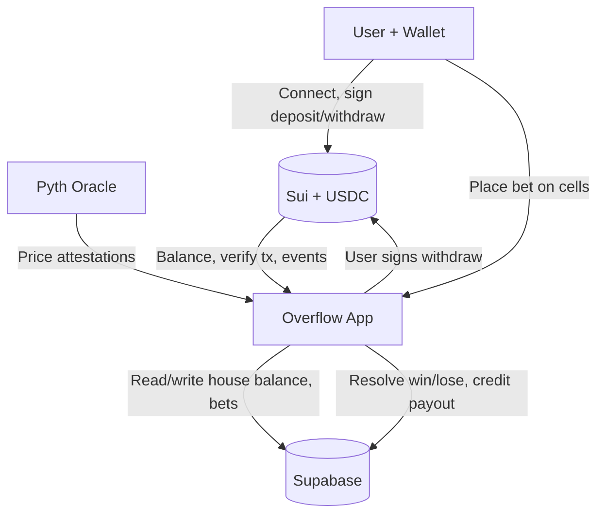

**Flow:** User ↔ Sui (deposit/withdraw) · User → App (bet) · Pyth → App (price) · App ↔ DB (state) · App → Sui (withdraw).

### User Flow

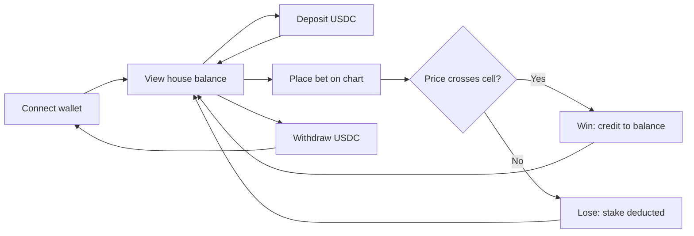

### High-Level Architecture

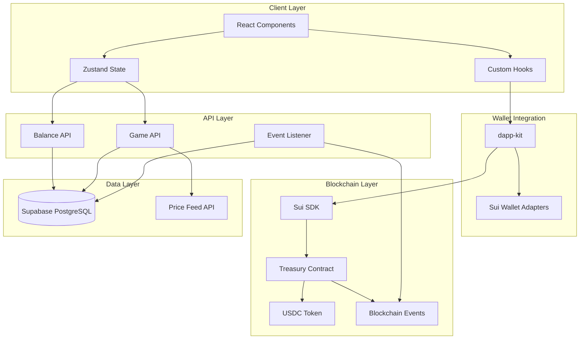

### Component Architecture

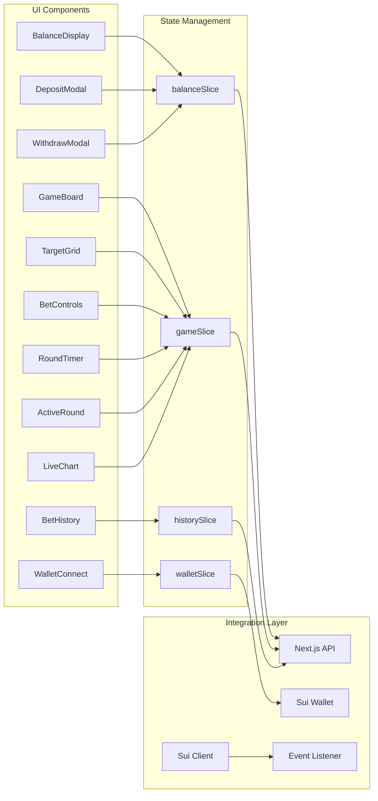

### Data Flow Diagrams

#### Deposit Flow

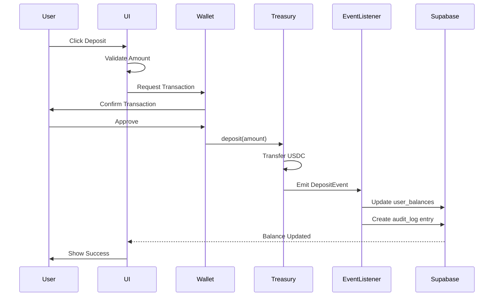

#### Withdrawal Flow

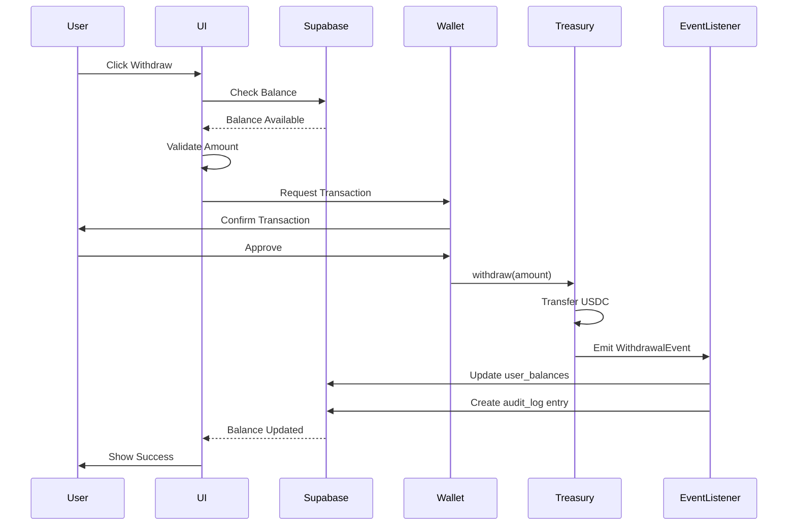

#### Bet Placement Flow

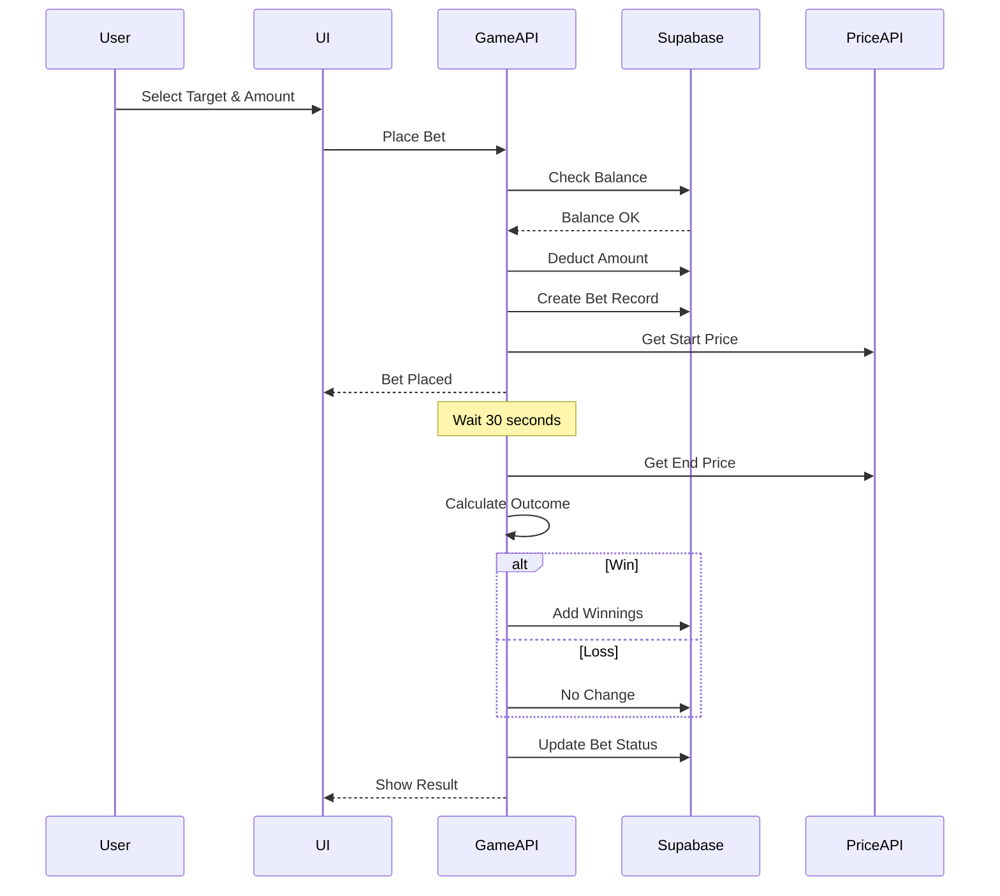

## Technical Stack

| Area | Technologies |
|------|--------------|
| **Frontend** | Next.js 16, React 19, TypeScript, Tailwind CSS 4, Zustand (state), Recharts (charts), TanStack React Query (used by dapp-kit) |
| **Blockchain** | Sui: `@mysten/dapp-kit` (wallet connect, UI), `@mysten/sui` (client, transactions); Move for treasury contract |
| **Prices** | **Pyth Network** (`@pythnetwork/hermes-client`) for BTC/SUI/SOL; mock feed in same file for fallback |
| **Backend / DB** | Next.js API routes (serverless), **Supabase** (PostgreSQL + `@supabase/supabase-js`) for balances, audit log, stored procedures |
| **Charts / UX** | Recharts, d3-scale / d3-shape, custom LiveChart with asset switcher (BTC/SUI/SOL) |
| **Dev / test** | Jest, Testing Library, fast-check, ESLint, Supabase CLI, ts-node for scripts |

### Frontend
- **Next.js 16**: React framework with App Router for server-side rendering and API routes
- **TypeScript**: Type-safe development with strict mode enabled
- **Tailwind CSS 4**: Utility-first CSS (PostCSS) for styling
- **Zustand**: Lightweight state management (store slices in `lib/store/`)
- **Recharts**: Composable charting library for price visualization
- **@mysten/dapp-kit**: Official Sui wallet integration with React hooks and UI

### Blockchain (Sui)
- **Sui** — Layer 1 with object-centric model, high throughput, and Move for secure DeFi
- **Sui Move** — Treasury contract with events and Coin standard for composability
- **@mysten/sui** — TypeScript SDK for client and transaction building
- **USDC on Sui** — Stablecoin for deposits and betting

### Backend
- **Next.js API Routes**: Serverless API endpoints for game logic
- **Supabase**: PostgreSQL database with real-time subscriptions
- **Node.js**: Runtime environment for event listener service

### Development
- **Jest**: Testing framework with coverage reporting
- **@testing-library/react**: Component testing utilities
- **fast-check**: Property-based testing library
- **ESLint**: Code linting with Next.js configuration
- **TypeScript Compiler**: Type checking and compilation

## Technologies Used (Where in the Project)

Every technology and where it appears in the codebase:

| Technology | Version / Package | Where it's used |
|------------|------------------|------------------|
| **Next.js** | 16.1.x | `app/` (App Router, layout, page, API routes under `app/api/`), `next.config.ts` |
| **React** | 19.2.x | All UI in `app/`, `components/` |
| **TypeScript** | ^5 | Entire codebase: `tsconfig.json`, all `.ts`/`.tsx` files |
| **Tailwind CSS** | ^4 | `app/globals.css`, `postcss.config.mjs`; styling across `components/` |
| **Zustand** | ^5 | `lib/store/` (walletSlice, gameSlice, balanceSlice, historySlice, index); consumed by `app/page.tsx`, `components/` |
| **@mysten/dapp-kit** | ^0.20 | `app/providers.tsx`, `lib/sui/wallet.ts`, `components/wallet/` (WalletConnect, WalletInfo) |
| **@mysten/sui** | ^1.45 | `lib/sui/client.ts`, `lib/sui/event-listener.ts`, `lib/sui/config.ts`; RPC, transactions, types |
| **Sui Move** | — | `sui-contracts/sources/treasury.move`, `Move.toml`, `Move.lock`; on-chain treasury |
| **Pyth Network** | @pythnetwork/hermes-client ^2.1 | `lib/utils/priceFeed.ts`; live BTC/SUI/SOL prices; referenced in `components/game/LiveChart.tsx` |
| **Supabase** | @supabase/supabase-js ^2.91 | `lib/supabase/client.ts`; `app/api/balance/*` routes; `lib/balance/synchronization.ts`; `supabase/migrations/`, `supabase/scripts/`, `supabase/__tests__/` |
| **TanStack React Query** | ^5.90 | Used internally by dapp-kit (providers); optional data fetching |
| **Recharts** | ^3.6 | `components/game/LiveChart.tsx` for price charts |
| **d3-scale / d3-shape** | ^4 / ^3.2 | `components/game/LiveChart.tsx` for chart scales and shapes |
| **Jest** | ^30 | `jest.config.js`, `jest.setup.js`; `**/__tests__/*.test.ts(x)` |
| **Testing Library** | @testing-library/react ^16, jest-dom ^6 | `components/**/__tests__/`, `app/api/**/__tests__/`, `lib/utils/__tests__/`, `lib/balance/__tests__/`, `supabase/__tests__/` |
| **fast-check** | ^4.5 | Property-based tests (e.g. in `lib/utils/__tests__/`, `lib/balance/__tests__/`) |
| **ESLint** | ^9 + eslint-config-next 16 | `eslint.config.mjs`; linting across the repo |
| **Supabase CLI** | ^2.72 | Local DB tooling; `supabase/` config, migrations, `db:verify`, `db:show-migration` |
| **ts-node** | ^10 | `supabase/scripts/*.ts`, `scripts/verify-deposit-withdrawal.ts`; running TS scripts |
| **Node.js** | 18+ | Runtime for Next.js, Jest, Supabase scripts, and CLI scripts |

Environment variables (see [Environment Variables](#environment-variables)) are read in: `lib/sui/config.ts`, `lib/utils/constants.ts`, `lib/supabase/client.ts`, `app/providers.tsx`, `supabase/scripts/`, and `scripts/verify-deposit-withdrawal.ts`.

## Prerequisites

- **Node.js** 18+ and npm
- **Sui wallet** (Sui Wallet, Suiet, Ethos) — set network to **Testnet**
- **Testnet SUI** for gas — [Sui Testnet Faucet](https://discord.com/channels/916379725201563759/971488439931392130)
- **Testnet USDC** for gameplay

## Getting Started

### 1. Install Dependencies

```bash
npm install
```

### 2. Environment variables

```bash
cp .env.example .env
```

Configure:

| Variable | Description |
|----------|-------------|
| `NEXT_PUBLIC_SUI_NETWORK` | `testnet` or `mainnet` |
| `NEXT_PUBLIC_SUI_RPC_ENDPOINT` | e.g. `https://fullnode.testnet.sui.io:443` |
| `NEXT_PUBLIC_TREASURY_PACKAGE_ID` | Treasury package ID (see [Treasury / contract address](#treasury--contract-address)) |
| `NEXT_PUBLIC_TREASURY_OBJECT_ID` | Treasury shared object ID |
| `NEXT_PUBLIC_USDC_TYPE` | USDC type on target network (testnet example in contract table) |
| `NEXT_PUBLIC_SUPABASE_URL` | Supabase project URL |
| `NEXT_PUBLIC_SUPABASE_ANON_KEY` | Supabase anon key |
| `NEXT_PUBLIC_APP_NAME` | Optional; default `Overflow` |
| `NEXT_PUBLIC_ROUND_DURATION` | Optional; default `30` (seconds) |
| `NEXT_PUBLIC_PRICE_UPDATE_INTERVAL` | Optional; default `1000` (ms) |
| `NEXT_PUBLIC_CHART_TIME_WINDOW` | Optional; default `300000` (5 min, ms) |

### 3. Supabase

1. Create a project at [supabase.com](https://supabase.com).
2. Run migrations in order in the SQL Editor: `supabase/migrations/001_*.sql` through `004_*.sql` (or use Supabase CLI: `supabase link` then `supabase db push`).
3. Put your Supabase URL and anon key in `.env`.

### 4. Run the app

```bash
npm run dev
```

Open [http://localhost:3000](http://localhost:3000).

### 5. Connect wallet and get testnet USDC

1. Install a Sui wallet (Sui Wallet, Suiet, or Ethos); switch to **Sui testnet**.
2. Get testnet SUI from the [faucet](https://discord.com/channels/916379725201563759/971488439931392130).
3. Get testnet USDC (faucet or project maintainers).
4. Click **Connect Sui Wallet** in the app.

## Project Structure

```
overflow/
├── app/                          # Next.js App Router
│   ├── api/                      # API Routes
│   │   └── balance/              # Balance management endpoints
│   │       ├── deposit/          # Deposit endpoint
│   │       ├── withdraw/         # Withdrawal endpoint
│   │       ├── bet/              # Bet placement endpoint
│   │       ├── win/              # Win payout endpoint
│   │       ├── events/           # Event listener endpoint
│   │       └── [address]/        # Balance query endpoint
│   ├── layout.tsx                # Root layout with providers
│   ├── page.tsx                  # Main game page
│   ├── providers.tsx             # Client-side providers
│   └── globals.css               # Global styles
│
├── components/                   # React Components
│   ├── wallet/                   # Wallet integration
│   │   ├── WalletConnect.tsx     # Wallet connection button
│   │   └── WalletInfo.tsx        # Wallet information display
│   ├── balance/                  # Balance management
│   │   ├── BalanceDisplay.tsx    # Balance display component
│   │   ├── DepositModal.tsx      # Deposit modal
│   │   └── WithdrawModal.tsx     # Withdrawal modal
│   ├── game/                     # Game components
│   │   ├── GameBoard.tsx         # Main game board
│   │   ├── BetControls.tsx       # Bet placement controls
│   │   ├── TargetGrid.tsx        # Betting targets grid
│   │   ├── LiveChart.tsx         # Price chart
│   │   ├── RoundTimer.tsx        # Round countdown timer
│   │   └── ActiveRound.tsx       # Active round display
│   ├── history/                  # Bet history
│   │   ├── BetHistory.tsx        # Bet history list
│   │   └── BetCard.tsx           # Individual bet card
│   └── ui/                       # Reusable UI components
│       ├── Button.tsx            # Button component
│       ├── Card.tsx              # Card component
│       ├── Modal.tsx             # Modal component
│       ├── Toast.tsx             # Toast notification
│       └── LoadingSpinner.tsx    # Loading indicator
│
├── lib/                          # Core Libraries
│   ├── sui/                      # Sui blockchain integration
│   │   ├── client.ts             # Sui client configuration
│   │   ├── config.ts             # Network configuration
│   │   ├── wallet.ts             # Wallet integration
│   │   └── event-listener.ts     # Event listener service
│   ├── store/                    # State management (Zustand)
│   │   ├── index.ts              # Store configuration
│   │   ├── walletSlice.ts        # Wallet state
│   │   ├── balanceSlice.ts       # Balance state
│   │   ├── gameSlice.ts          # Game state
│   │   └── historySlice.ts       # Bet history state
│   ├── balance/                  # Balance management
│   │   └── synchronization.ts    # Balance sync logic
│   ├── supabase/                 # Supabase client
│   │   └── client.ts             # Supabase configuration
│   ├── utils/                    # Utility functions
│   │   ├── constants.ts          # Application constants
│   │   ├── formatters.ts         # Data formatters
│   │   ├── errors.ts             # Error handling
│   │   └── priceFeed.ts          # Price feed integration
│   └── logging/                  # Logging utilities
│       └── error-logger.ts       # Error logging
│
├── sui-contracts/                # Sui Move Smart Contracts
│   ├── sources/                  # Contract source files
│   │   └── treasury.move         # Treasury contract
│   ├── build/                    # Compiled contracts
│   ├── Move.toml                 # Move package manifest
│   └── Move.lock                 # Move dependencies lock
│
├── supabase/                     # Supabase Configuration
│   ├── migrations/               # Database migrations
│   │   ├── 001_create_user_balances.sql
│   │   ├── 002_create_balance_audit_log.sql
│   │   ├── 003_create_balance_procedures.sql
│   │   └── 004_create_reconciliation_procedure.sql
│   ├── scripts/                  # Database scripts
│   │   ├── verify-setup.ts       # Verify database setup
│   │   └── apply-migration.ts    # Apply migrations
│   └── __tests__/                # Database tests
│       ├── user_balances.test.ts
│       ├── balance_audit_log.test.ts
│       └── balance_procedures.test.ts
│
├── types/                        # TypeScript Type Definitions
│   ├── sui.ts                    # Sui-specific types
│   ├── game.ts                   # Game-related types
│   ├── bet.ts                    # Bet-related types
│   └── flow.ts                   # Legacy Flow types
│
├── scripts/                      # Utility Scripts
│   └── verify-deposit-withdrawal.ts  # Test deposit/withdrawal
│
├── .kiro/                        # Kiro IDE Configuration
│   └── specs/                    # Project specifications
│       └── sui-migration/        # Migration documentation
│
├── .env                          # Environment variables
├── .env.example                  # Environment template
├── package.json                  # NPM dependencies
├── tsconfig.json                 # TypeScript configuration
├── tailwind.config.js            # Tailwind CSS configuration
├── next.config.ts                # Next.js configuration
├── jest.config.js                # Jest configuration
└── README.md                     # This file
```

## Database Schema

### Entity Relationship Diagram

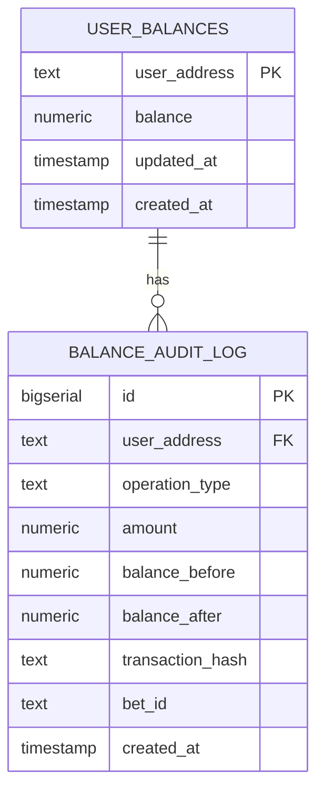

### Table Definitions

#### user_balances

Stores the current house balance for each user address.

| Column | Type | Constraints | Description |
|--------|------|-------------|-------------|
| user_address | TEXT | PRIMARY KEY | Sui wallet address |
| balance | NUMERIC(20,8) | NOT NULL, >= 0 | Current USDC balance |
| updated_at | TIMESTAMP | DEFAULT NOW() | Last update timestamp |
| created_at | TIMESTAMP | DEFAULT NOW() | Account creation timestamp |

#### balance_audit_log

Comprehensive audit trail for all balance operations.

| Column | Type | Constraints | Description |
|--------|------|-------------|-------------|
| id | BIGSERIAL | PRIMARY KEY | Auto-incrementing ID |
| user_address | TEXT | NOT NULL | Sui wallet address |
| operation_type | TEXT | NOT NULL | Operation type (deposit, withdrawal, bet_placed, bet_won, bet_lost) |
| amount | NUMERIC(20,8) | NOT NULL | Operation amount |
| balance_before | NUMERIC(20,8) | NOT NULL | Balance before operation |
| balance_after | NUMERIC(20,8) | NOT NULL | Balance after operation |
| transaction_hash | TEXT | NULL | Blockchain transaction hash |
| bet_id | TEXT | NULL | Associated bet ID |
| created_at | TIMESTAMP | DEFAULT NOW() | Operation timestamp |

### Stored Procedures

Balance updates use dedicated procedures that atomically update `user_balances` and insert into `balance_audit_log`:

- **deduct_balance_for_bet**(p_user_address, p_bet_amount) — Deducts balance for a bet; inserts audit row with `operation_type = 'bet_placed'`. Used by the bet API.
- **credit_balance_for_payout**(p_user_address, p_payout_amount, p_bet_id) — Credits winnings; audit `operation_type = 'bet_won'`.
- **update_balance_for_deposit**(p_user_address, p_amount, p_transaction_hash) — Credits balance and logs deposit. Used by the deposit API endpoint.
- **update_balance_for_withdrawal**(p_user_address, p_amount, p_transaction_hash) — Debits balance and logs withdrawal. Used by the withdraw API endpoint.

The Sui event listener (when it processes DepositEvent/WithdrawalEvent) updates `user_balances` and `balance_audit_log` directly. All operations are audited.

#### reconcile_balance

Reconciles user balance with blockchain state.

```sql
CREATE OR REPLACE FUNCTION reconcile_balance(
    p_user_address TEXT,
    p_expected_balance NUMERIC
) RETURNS TABLE(
    discrepancy NUMERIC,
    current_balance NUMERIC,
    expected_balance NUMERIC
)
```

## Smart Contract Architecture

Contract addresses and env vars are in [Treasury / contract address](#treasury--contract-address). To use your own deployment, see [Deploying Your Own Treasury Contract](#deploying-your-own-treasury-contract).

### Treasury Contract

The treasury contract manages USDC deposits and withdrawals using Sui Move.

#### Contract Structure

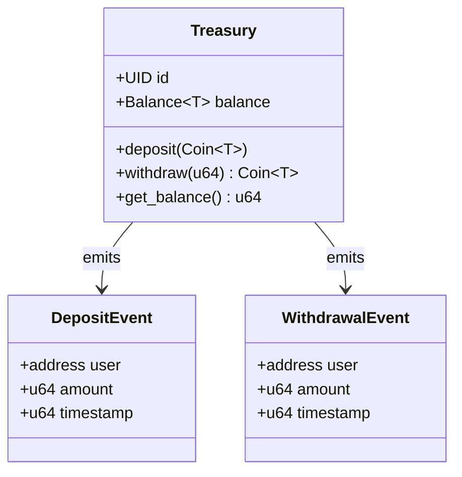

#### Key Functions

**deposit**
```move
public entry fun deposit<T>(
    treasury: &mut Treasury<T>,
    payment: Coin<T>,
    ctx: &mut TxContext
)
```
Deposits USDC tokens into the treasury and emits a DepositEvent.

**withdraw**
```move
public entry fun withdraw<T>(
    treasury: &mut Treasury<T>,
    amount: u64,
    ctx: &mut TxContext
): Coin<T>
```
Withdraws USDC tokens from the treasury and emits a WithdrawalEvent.

**get_balance**
```move
public fun get_balance<T>(treasury: &Treasury<T>): u64
```
Returns the current USDC balance in the treasury.

#### Event Structures

**DepositEvent**
```move
struct DepositEvent has copy, drop {
    user: address,
    amount: u64,
    timestamp: u64
}
```

**WithdrawalEvent**
```move
struct WithdrawalEvent has copy, drop {
    user: address,
    amount: u64,
    timestamp: u64
}
```

### Contract Deployment Process

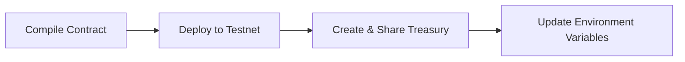

## Game Mechanics

### Steps

1. **Connect** — Sui dapp-kit; address and house balance load from API.
2. **Deposit** — User signs a Sui transaction to deposit USDC to the treasury; app sends tx digest to `/api/balance/deposit`; event listener credits house balance.
3. **Bet** — User selects amount and a price cell (multiplier); `/api/balance/bet` deducts stake from house balance; resolution when price crosses the cell. **Win:** credit stake × multiplier via `/api/balance/win`. **Lose:** stake already deducted.
4. **Withdraw** — User signs withdraw; treasury contract sends USDC to user; event listener debits house balance.

Timeframes (5s, 15s, 30s, 1m, 3m, 5m) set the duration of each grid column. Blitz rounds offer 2× multipliers with optional paid entry (x402).

### Round System

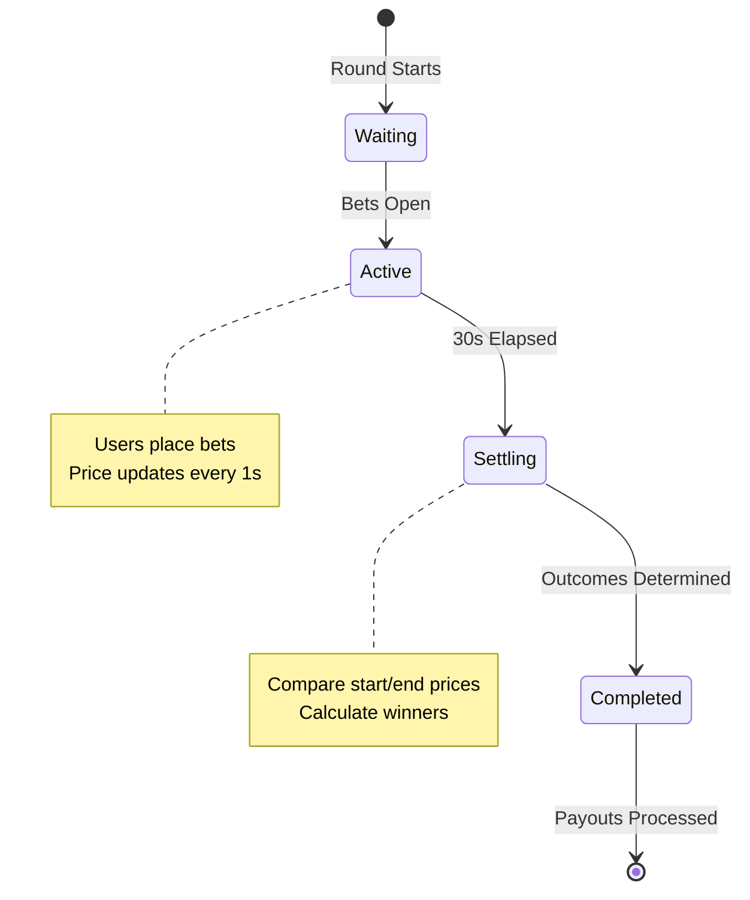

### Betting Targets

The game offers multiple betting targets based on BTC price move (in USD) over the 30-second round, with configurable multipliers:

| Target | Label | Price Move | Multiplier |
|--------|--------|------------|------------|
| 1 | +$5 in 30s | +$5 | 1.5x |
| 2 | +$10 in 30s | +$10 | 2.0x |
| 3 | +$20 in 30s | +$20 | 3.0x |
| 4 | +$50 in 30s | +$50 | 5.0x |
| 5 | +$100 in 30s | +$100 | 10.0x |
| 6 | -$5 in 30s | -$5 | 1.5x |
| 7 | -$10 in 30s | -$10 | 2.0x |
| 8 | -$20 in 30s | -$20 | 3.0x |

### Payout Calculation

```
Payout = Bet Amount × Multiplier (if target hit)
Payout = 0 (if target missed)
```

### House Balance System

The house balance system enables fast bet placement without blockchain transactions:

1. User deposits USDC to treasury (on-chain)
2. Event listener credits house balance (off-chain)
3. User places bets using house balance (off-chain)
4. Winnings credited to house balance (off-chain)
5. User withdraws to wallet (on-chain)

**Design rationale:** This hybrid approach optimizes for three goals that Sui is well-suited to support:
- **Security** — Deposits and withdrawals are on-chain; Move and the Coin standard ensure correct handling of funds.
- **Performance** — Rounds and bets run off-chain so the game stays fast and scalable without per-bet gas.
- **User experience** — One-click bets and instant feedback; users sign only for deposit/withdraw.

## Testing

### Run Frontend Tests

```bash
npm test
```

### Run Tests with Coverage

```bash
npm run test:coverage
```

### Test Deposit and Withdrawal

```bash
npm run verify-deposit-withdrawal
```

## Network Configuration

The application supports multiple Sui networks. Configure via `NEXT_PUBLIC_SUI_NETWORK` environment variable.

| Network | Description | RPC Endpoint |
|---------|-------------|--------------|
| testnet | Sui testnet (default) | https://fullnode.testnet.sui.io:443 |
| mainnet | Sui mainnet | https://fullnode.mainnet.sui.io:443 |
| devnet | Sui devnet | https://fullnode.devnet.sui.io:443 |
| localnet | Local Sui node | http://localhost:9000 |

## Environment Variables

These match what the app reads from `.env`; use `.env.example` as a template. For the app’s **testnet deployment**, use the contract addresses in [Treasury / contract address](#treasury--contract-address).

### Required Variables

| Variable | Description | Example |
|----------|-------------|---------|
| `NEXT_PUBLIC_SUI_NETWORK` | Sui network to connect to | `testnet` |
| `NEXT_PUBLIC_SUI_RPC_ENDPOINT` | Sui RPC endpoint URL | `https://fullnode.testnet.sui.io:443` |
| `NEXT_PUBLIC_TREASURY_PACKAGE_ID` | Treasury contract package ID (used for wallet, deposits, AI Insight, Blitz) | See [Treasury / contract address](#treasury--contract-address) |
| `NEXT_PUBLIC_TREASURY_OBJECT_ID` | Treasury shared object ID | See [Treasury / contract address](#treasury--contract-address) |
| `NEXT_PUBLIC_USDC_TYPE` | USDC token type on Sui (must match network) | See [Treasury / contract address](#treasury--contract-address) |
| `NEXT_PUBLIC_SUPABASE_URL` | Supabase project URL | `https://xxx.supabase.co` |
| `NEXT_PUBLIC_SUPABASE_ANON_KEY` | Supabase anonymous key | `eyJ...` |

### Optional Variables

| Variable | Description | Default |
|----------|-------------|---------|
| `NEXT_PUBLIC_APP_NAME` | Application display name | `Overflow` |
| `NEXT_PUBLIC_ROUND_DURATION` | Round duration in seconds | `30` |
| `NEXT_PUBLIC_PRICE_UPDATE_INTERVAL` | Price update interval in ms | `1000` |
| `NEXT_PUBLIC_CHART_TIME_WINDOW` | Chart time window in ms (e.g. 300000 = 5 min) | `300000` |

## Deploying Your Own Treasury Contract

### Prerequisites

- Sui CLI installed ([installation guide](https://docs.sui.io/build/install))
- Sui wallet with testnet SUI for gas
- Basic understanding of Sui Move

### Deployment Steps

1. Build the contract:
```bash
cd sui-contracts
sui move build
```

2. Deploy to testnet:
```bash
sui client publish --gas-budget 100000000
```

3. Note the package ID from the output

4. Create a treasury instance:
```bash
sui client call \
  --package <PACKAGE_ID> \
  --module treasury \
  --function create_treasury \
  --type-args "<USDC_TYPE>" \
  --gas-budget 10000000
```

5. Note the treasury object ID from the output

6. Update `.env`:
```bash
NEXT_PUBLIC_TREASURY_PACKAGE_ID=<PACKAGE_ID>
NEXT_PUBLIC_TREASURY_OBJECT_ID=<TREASURY_OBJECT_ID>
```

## Development Workflow

### Initial Setup

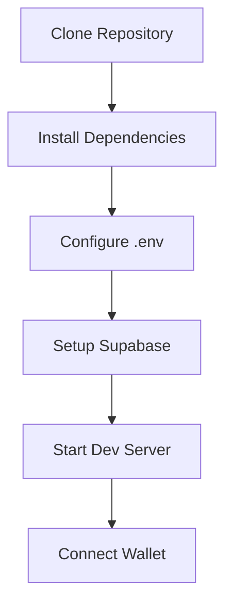

### Development Cycle

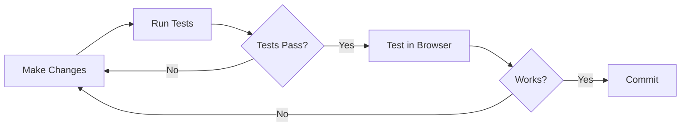

### Typical User Flow

1. Connect Sui wallet
2. Deposit USDC to house balance
3. Wait for round to start
4. Select betting target
5. Place bet
6. Watch price movement
7. Receive payout (if win)
8. Withdraw to wallet (optional)

## API Overview

| Method | Path | Purpose |
|--------|------|---------|
| GET    | `/api/balance/[address]` | House balance for address |
| POST   | `/api/balance/deposit`     | Credit after user deposit tx |
| POST   | `/api/balance/withdraw`    | Debit + treasury withdraw to user |
| POST   | `/api/balance/bet`         | Deduct balance for a bet |
| POST   | `/api/balance/win`         | Credit winnings |
| GET    | `/api/balance/events`      | Event listener (DepositEvent / WithdrawalEvent) |
| GET    | `/api/ai/predict`         | x402 AI insight (payment required) |
| GET    | `/api/blitz/enter`        | x402 Blitz entry |

## Competitive Landscape

Comparison with other binary / price-prediction dApps (approximate; check each product for current details).

| Platform | Chain | Asset | Timeframes | Mechanic | Oracle | House balance / custody |
|----------|-------|-------|------------|----------|--------|-------------------------|
| **Overflow** | **Sui** | **USDC** | **5s–5m (incl. 3m)** | **Grid cells, price crosses level** | **Pyth Hermes** | **Move treasury + off-chain house balance** |
| Stellarnomo | Stellar | XLM | 5s–5m (incl. 3m) | Grid cells, price crosses level | Pyth Hermes | Treasury account + off-chain house balance |
| Polymarket (crypto) | Polygon | USDC, shares | Hourly+ | Event yes/no, 1h candle | Binance | AMM / order book |
| Injective (binary) | Injective | USDT | Varies | Binary outcome $0–$1 | Chain oracles | Exchange module |
| PancakeSwap Prediction | BNB Chain | BNB, CAKE | 5 min | Bull/Bear round, pool payout | Chainlink | Pool, 3% fee |
| Buffer Finance | Arbitrum / Hyperliquid | USDC, ARB | 1 min+ | Up/Down, Above/Below | Pyth | ERC-721 positions |
| Supa.Market | BNB Chain | BNB | 60 sec | Up/Down PvP | Binance API | No house edge claim |

**Overflow differentiators:** Sui-native (USDC, Move treasury, dapp-kit); short timeframes (5s–5m, incl. 3m); grid + multiplier; Pyth attestations for resolution; x402 for AI insight and Blitz entry; Move shared object + event-driven sync for on-chain custody and off-chain speed.

## Security Considerations

### Smart Contract Security

- Treasury uses Sui’s **Coin** standard for safe, composable token handling
- All deposits and withdrawals **emit events** for indexing and audit; event-driven sync keeps off-chain state correct
- Balance checks prevent overdraft; Move’s type system limits attack surface
- **Shared object** pattern allows permissionless deposit/withdraw while keeping a single source of truth

### Off-Chain Security

- Supabase Row Level Security (RLS) policies protect user data
- Balance updates use atomic transactions with audit logging
- Event listener validates all blockchain events before processing
- API endpoints validate user addresses and amounts

### Best Practices

- Never store private keys in code or environment variables
- Always verify transaction results before updating database
- Implement rate limiting on API endpoints
- Monitor audit logs for suspicious activity
- Regular reconciliation between blockchain and database state

## Troubleshooting

### Wallet Connection Issues

**Problem**: Wallet not connecting
- Ensure wallet extension is installed and unlocked
- Check that wallet is on correct network (testnet)
- Try refreshing the page

**Problem**: Wrong network
- Open wallet settings
- Switch to Sui testnet
- Refresh the application

### Transaction Failures

**Problem**: Insufficient gas
- Get testnet SUI from [faucet](https://discord.com/channels/916379725201563759/971488439931392130)
- Ensure at least 0.1 SUI for gas

**Problem**: Insufficient USDC
- Check USDC balance in wallet
- Deposit more USDC if needed

### Balance Sync Issues

**Problem**: Balance not updating after deposit
- Wait 5-10 seconds for event processing
- Check transaction on [Sui Explorer](https://suiexplorer.com)
- Verify event listener is running

**Problem**: Balance mismatch
- Run reconciliation script: `npm run reconcile`
- Check audit logs in Supabase

## Performance Optimization

### Frontend Optimization

- React components use memoization to prevent unnecessary re-renders
- Zustand store minimizes state updates
- Chart data is windowed to reduce memory usage
- API calls are debounced to reduce server load

### Backend Optimization

- Database indexes on user_address for fast lookups
- Stored procedures for atomic balance updates
- Connection pooling for Supabase client
- Event listener uses efficient polling strategy

### Blockchain Optimization

- Batch transaction building when possible
- Gas budget optimization for contract calls
- Event subscription instead of polling
- Shared object pattern for concurrent access

## Contributing

Contributions are welcome. Please follow these guidelines:

1. Fork the repository
2. Create a feature branch
3. Write tests for new functionality
4. Ensure all tests pass
5. Submit a pull request

## Roadmap & Continued Development

Overflow is built with ongoing development in mind:

- **Mainnet readiness** — Same architecture and contracts can target Sui mainnet with config and asset updates.
- **Composability** — Treasury and events can integrate with Sui PTBs (Programmable Transaction Blocks), DeepBook, and other DeFi building blocks.
- **Feature expansion** — Additional assets, round types, and on-chain settlement paths are natural next steps.
- **Ecosystem alignment** — Designed to evolve with Sui’s DeFi standards and tooling.
